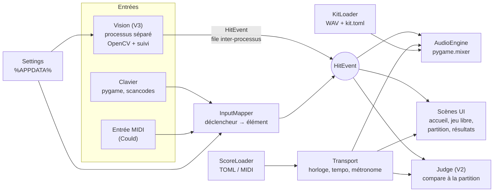

# Cadrage de projet — Batterie virtuelle

> Partie A : le brief (version du 2026-10-03, champs manquants notés « à faire plus tard »). Partie B : la réponse de Claude.

# Partie A — Brief

## 1. Instructions pour Claude

Tu es mon architecte logiciel et tech lead sur ce projet. À partir de ce document, tu cadres entièrement le projet avant toute ligne de code.

**Règles de réponse :**

1. Commence par reformuler le projet en 3 à 5 lignes pour vérifier que tu l'as compris.
2. Si une information bloquante manque ou si deux contraintes se contredisent, pose-moi tes questions **avant** de proposer la stack (5 questions maximum, classées par importance).
3. Justifie chaque choix technique par mes contraintes (niveau, matériel, budget, temps), et cite l'alternative écartée.
4. Privilégie la solution la plus simple qui atteint l'objectif. Signale toute sur-ingénierie que je te demanderais.
5. Respecte strictement le niveau de collaboration choisi en section 7.
6. Respecte strictement le format de réponse de la section 9.
7. Langue des échanges : français. Langue du code et des commentaires : anglais pour le code et pour les fonctionnalités git, français pour les commentaires

## 2. Qui je suis

- **Profil** : je joue (ou veux jouer) de la batterie et je souhaite m'entraîner à lire des partitions sur mon ordinateur. Je ne souhaite pas spécialement apprendre à coder : Claude s'occupe de tout le code.
- **Disponibilité** : 5 à 15 heures par semaine (hors travail Claude code).
- **Ce que je veux en tirer** : livrer avant tout (un outil d'entraînement qui marche).
- **Compétences à développer sur ce projet** : aucune côté code ; l'objectif est de progresser à la batterie.

**Mon niveau par technologie** (0 = jamais utilisé, 3 = autonome) — à titre indicatif, je n'écrirai pas le code moi-même :

| Domaine | Niveau 0-3 | Commentaire |
| --- | --- | --- |
| Python | 2 | |
| JavaScript / TypeScript | 0 | |
| HTML / CSS | 0 | |
| SQL / bases de données | 2 | |
| Git / GitHub | 2 | Utile pour relire et fusionner les PR de Claude |
| Docker / conteneurs | 1 | |
| Tests automatisés | 2 | |
| Machine learning / vision par ordinateur | 1 | Concerne la V3 |
| Déploiement / hébergement | 1 | |

## 3. Contexte du projet

- **Nom provisoire** : Batterie
- **Pitch en une phrase** : une batterie virtuelle sur ordinateur, jouable au clavier puis par détection des gestes filmés par caméra, qui affiche les coups à jouer pour s'entraîner sur des partitions.
- **Origine** : je veux recréer l'instrument sur mon ordinateur pour pouvoir m'entraîner à jouer des partitions.
- **Nature du projet** : perso.
- **Commanditaire** : moi.
- **Niveau technique du commanditaire** : technique
- **Existant** : aucun code. Le projet Claude « Batterie » sert d'espace de travail.
- **Références / inspirations** : ⏳ *À faire plus tard* (optionnel)

## 4. Objectif final et critères de succès

- **Vision finale** : je joue de la batterie « dans le vide » devant des caméras, avec des baguettes artificielles ; le programme reconnaît mes mains et mes pieds, joue le son de l'élément frappé et me guide sur une partition choisie (jazz, rock, autre style, ou exercice de batterie seule).
- **Versions prévues** :
    - **V1 — Batterie au clavier** : je lance un programme qui ouvre une fenêtre affichant une batterie vue du dessus / légèrement de face, avec la touche du clavier associée à chaque élément de l'instrument. Appuyer sur une touche joue le son de l'élément correspondant.
    - **V2 — Partitions** : je lance un programme qui me fait choisir une partition (morceau de jazz, de rock, autre, ou partition de batterie seule) et qui affiche les touches du clavier à jouer, au bon moment, pour produire les bons sons.
    - **V3 — Reconnaissance visuelle** : des caméras filment, selon les angles nécessaires, les parties de mon corps qui jouent sur l'instrument : les pieds pour la grosse caisse (et la charleston), les mains équipées de baguettes artificielles pour les autres caisses, cymbales et toms. Les coups détectés remplacent les touches du clavier.
    - La V3 peut être découpée en autant de sous-versions que nécessaire (*ex. : une main sur un seul élément → deux mains → pieds → plusieurs caméras*). Claude propose le découpage.
- **MVP** : la V1.
- **Critères de succès mesurables** :
    - V1 : chaque touche déclenche le son de son élément, sans latence perceptible, et je peux enchaîner des coups rapides.
    - V2 : je peux choisir un morceau et le jouer du début à la fin en suivant les touches affichées.
    - V3 : un coup de baguette ou de pied filmé déclenche le son du bon élément, assez vite et assez fiablement pour remplacer le clavier.
- **Hors périmètre** : rien
- **Échéance** : aucune.
- **Après le projet** : publié en open source

## 5. Utilisateurs et besoins fonctionnels

**Utilisateurs** :

| Profil | Combien | Ce qu'il fait avec l'outil | Support utilisé |
| --- | --- | --- | --- |
| Moi, batteur qui s'entraîne | 1 | Joue de la batterie virtuelle et suit des partitions | Ordinateur + clavier (V1-V2), puis caméras + baguettes artificielles (V3) |

**Fonctionnalités souhaitées** (liste brute, Claude les priorisera) :

- Ouvrir une fenêtre avec une batterie dessinée vue du dessus / légèrement de face.
- Afficher sur chaque élément de la batterie la touche du clavier associée.
- Jouer le son de l'élément quand j'appuie sur sa touche.
- Choisir une partition parmi plusieurs styles : jazz, rock, autre, ou batterie seule.
- Pendant le morceau, afficher les touches à jouer au bon moment.
- Filmer mes mains et mes pieds avec une ou plusieurs caméras, sous les angles nécessaires.
- Détecter les coups des baguettes artificielles et des pieds, et les associer au bon élément de la batterie.
- Jouer le son correspondant à chaque coup détecté.

**Parcours clé** :

1. Je lance le programme.
2. Je choisis une partition (style ou morceau).
3. La batterie s'affiche avec les touches associées, et les coups à jouer défilent.
4. Je joue au clavier (V2) ou avec mes baguettes et mes pieds devant les caméras (V3).
5. Chaque coup produit le son de l'élément joué.

**Règles métier connues** :

- Une touche (puis un geste détecté) = un élément de la batterie = un son.
- Pieds : grosse caisse (et pédale de charleston). Mains : caisse claire, toms, cymbales.

## 6. Contraintes

### 6.1 Matériel

| Élément | Valeur |
| --- | --- |
| Système d'exploitation | Windows |
| Processeur | Intel Core i7-1255U (12e génération), 1,70 GHz |
| Mémoire vive (Go) | 16 Go |
| Carte graphique (modèle, Go de VRAM) | Intel Iris Xe Graphics, intégrée — pas de VRAM dédiée (mémoire partagée avec la RAM) |
| Espace disque libre (Go) | ⏳ *À faire plus tard* |
| Caméras / webcams déjà possédées | Webcam intégrée à l'ordinateur portable (modèle non précisé) ; aucune caméra externe |
| Sortie audio | Casque filaire — latence validée en phase 01 (ADR 0001) |
| Autres machines | ⏳ *À faire plus tard* (optionnel) |

### 6.2 Environnement

- **Droits administrateur sur la machine** : oui
- **Restrictions** : ⏳ *À faire plus tard* (optionnel)
- **Outils déjà installés** : ⏳ *À faire plus tard* (optionnel)

### 6.3 Budget

| Poste | Montant max |
| --- | --- |
| Mise de départ (€) | 0 €, hors caméras |
| Caméras (€) | 50€ montant max |
| Mensuel récurrent (€/mois) | 0 € |
| Nom de domaine | aucun |
| Calcul GPU cloud (€/mois) | 0 € |
| API ou données payantes (€/mois) | 0 € |

### 6.4 Technologies

- **Imposées** : aucune
- **Souhaitées** : uv pour l’environnement et les tests si il y a du python; Claude choisit.
- **Interdites ou à éviter** : tout outil, bibliothèque ou service payant.

### 6.5 Données

- **Sources** : sons de batterie (échantillons) et partitions de morceaux (jazz, rock, autre, batterie seule). Format et provenance à proposer par Claude, gratuits uniquement.
- **Volume estimé** : ⏳ *À faire plus tard* (optionnel)
- **Données personnelles ou sensibles** : images de moi filmées par les caméras en V3.

### 6.6 Légal et sécurité

- **Points connus** : droits sur les échantillons sonores et les partitions de morceaux existants ; budget nul, donc sources libres de droits ou gratuites uniquement.
- **Authentification nécessaire** : non.

### 6.7 Maintenance et passation

- **Qui maintient après la livraison** : Claude, sur mes demandes.
- **Temps de maintenance acceptable** : ⏳ *À faire plus tard* (optionnel)

## 7. Mode de collaboration avec Claude

| Niveau | Accès donnés à Claude | Ce que fait Claude | Ce que je fais | Idéal pour | CLAUDE.md |
| --- | --- | --- | --- | --- | --- |
| **0 — Mentor** | Conversation seule | Explique, donne des indices, du pseudo-code, relit le code que je colle. Ne donne la solution complète que si j'écris « solution ». | J'écris 100 % du code | Projets pédagogiques | Optionnel : un `PROJECT_CONTEXT.md` collé dans les instructions d'un Projet Claude |
| **1 — Assistant** | Conversation + fichiers que je joins | Produit du code et des fichiers complets dans le chat | Je copie, j'exécute, je commit | Prototypes, petits scripts | Optionnel, comme niveau 0 |
| **2 — Relecteur du dépôt** | Conversation + dépôt GitHub connecté en **lecture** | Lit tout le dépôt, propose des modifications sous forme de diffs | J'applique, je teste, je commit | Projets moyens où je veux garder la main | Recommandé |
| **3 — Claude Code supervisé** | Claude Code sur le dossier du projet, mode par défaut (demande avant chaque modification et commande) | Planifie (mode plan) puis code, lance les tests, avec mon accord à chaque action | Je valide chaque action, relis les diffs, je commit | Apprendre en regardant faire, projets avec données sensibles | **Obligatoire** |
| **4 — Claude Code semi-autonome** | Claude Code avec modifications de fichiers acceptées automatiquement, commandes autorisées listées dans `.claude/settings.json`, push sur branches via `gh` | Travaille sur une branche par fonctionnalité, commit, ouvre une Pull Request | Je relis et je fusionne la PR | Projets « livrer avant tout » | **Obligatoire** + `.claude/settings.json` |
| **5 — Accès complet** | Claude Code + GitHub (PR, issues, Actions), connecteurs, dossiers du poste, navigateur, tâches planifiées, sous-agents | Enchaîne les tâches de bout en bout, gère les issues, la CI et la doc | Je fixe les objectifs et je fais les revues de phase | Projets d'infra / data | **Obligatoire** + `settings.json` + hooks |

**Mon choix** :

- Niveau global : 4 — Claude écrit tout le code ; mon rôle est de tester chaque version en jouant et de fusionner les PR.
- Exceptions par phase : aucune.
- Accès disponibles : je donne à Claude l'accès nécessaire pour coder. Compte GitHub : `leonardgst` ; Claude Code installé : oui ; app desktop Claude : installée mais l'exécuteur ne fonctionne pas (sans impact : le projet passe par Claude Code en ligne de commande).

### 7.1 Garde-fous (niveaux 3 à 5)

- Branche `main` protégée : Claude ne pousse jamais directement dessus.
- Secrets hors dépôt : `.env` dans `.gitignore`, lecture de `.env` refusée dans `.claude/settings.json`, `.env.example` versionné à la place.
- Commandes destructrices interdites sans accord (suppression de fichiers, `git push --force`).
- Dépôt sauvegardé sur GitHub avant chaque session autonome.
- Plafond de dépenses : 0 €/mois.

### 7.2 Le CLAUDE.md

Claude génère un `CLAUDE.md` à la racine du dépôt dans sa première réponse. Claude Code le lit au début de chaque session : c'est la mémoire du projet. Il doit rester court (une page ou deux) et renvoyer vers `docs/` pour le détail.

Contenu attendu :

1. Contexte du projet en 5 lignes et lien vers `docs/00-cadrage.md`.
2. Stack technique et versions.
3. Commandes : installer, lancer, tester, linter.
4. Structure des dossiers.
5. Conventions : nommage, style de code, messages de commit (Conventional Commits), branches.
6. Niveau de collaboration choisi et ce que Claude a le droit de faire seul.
7. Règles de documentation (section 8) : quoi mettre à jour, quand.
8. Phase en cours et lien vers son document.
9. Interdits et pièges connus.

## 8. Documentation du projet

Le projet est piloté par sa documentation : chaque phase a son document, mis à jour en continu et clôturé avec une date et un tag Git. Claude crée les squelettes dès le cadrage et les tient à jour à chaque fin de tâche.

### 8.1 Arborescence attendue

```
README.md                      présentation, installation, lancement
CLAUDE.md                      mémoire du projet pour Claude Code
CHANGELOG.md                   format Keep a Changelog, versions SemVer
docs/
  00-cadrage.md                ce document + la réponse de Claude
  01-specifications.md         stack fonctionnelle détaillée
  02-architecture.md           stack technique, schémas, modèle de données
  adr/
    0001-choix-du-moteur-audio.md une décision d'architecture par fichier
  phases/
    phase-01-<nom>.md          un document par phase
    phase-02-<nom>.md
  journal.md                   journal de bord daté
  glossaire.md                 termes musicaux et techniques
```

### 8.2 Modèle de document de phase

```markdown
# Phase 01 — <Nom de la phase>

| Statut | Prévue | Terminée le | Tag Git |
| --- | --- | --- | --- |
| À faire / En cours / Terminée / Abandonnée | <dates> | <AAAA-MM-JJ> | v0.1.0 |

## Objectif
## Livrables
- [ ] ...
## Critères de fin (Definition of Done)
- [ ] Tests au vert
- [ ] Documentation à jour
- [ ] Testé en jouant
## Décisions prises (liens vers les ADR)
## Écarts par rapport au plan
## Rétrospective : ce qui a marché, ce qui a coincé
```

### 8.3 Clôture d'une phase

1. Tous les critères de fin sont cochés.
2. Le document de phase passe en « Terminée » avec la date du jour.
3. `CHANGELOG.md` reçoit une entrée pour la version.
4. Un tag annoté est posé : `git tag -a v0.1.0 -m "Phase 01 terminée : <nom>"` puis poussé.
5. Le tag est reporté dans le document de phase et dans `journal.md`.
6. `CLAUDE.md` pointe vers la phase suivante.

### 8.4 Règles de mise à jour

- Chaque décision technique non triviale donne un ADR (contexte, options, décision, conséquences).
- Chaque session de travail ajoute une ligne datée dans `journal.md`.
- Un document n'est jamais supprimé : une phase abandonnée garde son fichier avec le statut « Abandonnée » et la raison.
- Convention de versions : v0.<phase>.0

## 9. Ce que j'attends en retour

Réponds dans cet ordre, avec ces titres.

1. **Reformulation et questions** : le projet en 3 à 5 lignes, puis les questions bloquantes. S'il y en a, arrête-toi là et attends mes réponses.
2. **Stack fonctionnelle**
    - Fonctionnalités priorisées en MoSCoW (Must / Should / Could / Won't), sous forme de tableau.
    - User stories principales avec critères d'acceptation.
    - Parcours utilisateur clé, étape par étape.
    - Règles métier et données manipulées (éléments de la batterie, sons, partitions, correspondances touche / geste → élément).
3. **Stack technique** : un tableau Couche · Choix · Pourquoi · Alternative écartée · Coût, couvrant :
    - langage et frameworks ;
    - stockage (sons, partitions, réglages) ;
    - distribution (comment je lance le programme sur mon ordinateur) ;
    - outillage : gestion d'environnement et des dépendances, lint/format, tests, CI/CD ;
    - spécifique au projet : moteur audio basse latence, format et lecture des partitions, affichage graphique, vision par ordinateur et choix des caméras (nombre, angles, type de baguettes artificielles).
4. **Architecture** : schéma des composants (Mermaid), modèle de données, arborescence du code.
5. **Découpage en phases** : V1, V2, puis la V3 découpée en sous-versions. Pour chaque phase : objectif, livrables, critères de fin, estimation en heures, niveau de collaboration Claude.
6. **Risques** : les 3 à 5 principaux, avec leur parade (*ex. : latence audio, fiabilité de la détection des coups, puissance de calcul, disponibilité de partitions gratuites*).
7. **Budget estimé** : coût de départ et coût mensuel, comparés à mes limites, avec une recommandation de caméras.
8. **Documentation initiale** : le contenu de `docs/00-cadrage.md` (synthèse), le squelette de `docs/phases/phase-01-*.md`, et le `CLAUDE.md`.
9. **Première action** : ce que je fais concrètement dans la prochaine heure.

## 10. Annexes

- **Fichiers joints** : ⏳ *À faire plus tard* (optionnel)
- **Liens utiles** : ⏳ *À faire plus tard* (optionnel)
- **Notes libres** : la V3 peut être découpée en autant de versions que nécessaire.
---

# Partie B — Réponse de Claude (cadrage du 2026-10-03)

> **Synthèse.** Application de bureau Windows en Python (uv, pygame-ce), open source. V1 : batterie au clavier, son via `pygame.mixer` à faible latence. V2 : partitions au format texte (type tablature) qui défilent avec leurs touches. V3 : webcams + baguettes à embout coloré, suivi OpenCV sur CPU, découpée en 4 sous-versions avec une preuve de concept à 0 € avant tout achat. Coût : 0 € de logiciel, ≤ 50 € de matériel. Claude Code travaille en niveau 4 (branche → PR), tu testes en jouant et tu fusionnes.

## 1. Reformulation et questions

**Reformulation.** Batterie est une application de bureau Windows, publiée en open source, qui transforme l'ordinateur en batterie d'entraînement. En V1, une fenêtre montre un kit vu de dessus (légèrement de face), chaque élément porte sa touche, et chaque frappe joue son échantillon sans retard perçu. En V2, on choisit une partition (rock, jazz, autre, batterie seule) et les coups à jouer défilent en rythme avec leur touche. En V3, des webcams et des baguettes à embout coloré remplacent le clavier, d'abord pour une main sur un élément, jusqu'au kit complet mains et pieds. Claude Code code en semi-autonomie (niveau 4) ; tu testes en jouant et tu fusionnes les PR.

**Questions bloquantes : aucune.** Les champs vides sont notés « à faire plus tard » ; aucun ne bloque la V1 ni la V2. Hypothèses retenues en attendant :

| À compléter plus tard | Nécessaire avant | Hypothèse en attendant |
| --- | --- | --- |
| Processeur, mémoire vive, disque | Phase 03 (vision) | PC récent, 8 Go ou plus, quelques Go libres |
| Carte graphique | Phase 03 | Aucune : tout est conçu pour tourner sur le processeur |
| Webcams déjà possédées | Phase 03 | Webcam intégrée ou aucune |
| Sortie audio | Phase 01 (tests de latence) | Casque ou enceintes **filaires** (le Bluetooth ajoute un retard très audible) |
| Restrictions, outils installés, autres machines | Phase 01 | Aucune restriction ; Git, uv et gh à installer |
| Volume de données | — | ~50 Mo de sons, quelques dizaines de partitions texte |
| Références, liens, fichiers joints | — | Aucun |
| Temps de maintenance | Après la v1.0 | À la demande |
| Licence du code | Phase 07 (publication) | MIT proposée |

**Points signalés (non bloquants) :**

- **Lire une partition ≠ suivre des touches qui défilent.** Ton profil vise la lecture de partitions ; le défilement de touches entraîne surtout le rythme. J'ajoute une vue en notation de batterie (portée) en *Could*, activable plus tard sans refonte.
- **« Hors périmètre : rien »** : je liste quand même des *Won't*, en particulier aucun morceau sous droits dans un dépôt public.
- **Budget 0 €/mois et Claude Code** : Claude Code nécessite un abonnement Claude. Je considère ton abonnement existant comme hors budget projet. Ne jamais configurer de clé API (facturation à l'usage).
- **App desktop dont l'exécuteur ne marche pas** : sans impact, le niveau 4 passe par Claude Code dans un terminal.

## 2. Stack fonctionnelle

### 2.1 Fonctionnalités priorisées (MoSCoW)

| Priorité | Id | Fonctionnalité | Version |
| --- | --- | --- | --- |
| Must | M1 | Fenêtre avec la batterie dessinée (vue de dessus, légèrement de face), 10 éléments | V1 |
| Must | M2 | Touche du clavier affichée sur chaque élément | V1 |
| Must | M3 | Touche → son de l'élément ; polyphonie ; coups rapides ; pas de retard perçu | V1 |
| Must | M4 | Retour visuel : l'élément frappé s'illumine | V1 |
| Must | M5 | Kit de sons libre de droits inclus | V1 |
| Must | M6 | Bibliothèque de partitions classées par style (rock, jazz, autre, batterie seule) | V2 |
| Must | M7 | Coups à jouer qui défilent avec leur touche, synchronisés au tempo ; décompte et métronome | V2 |
| Must | M8 | Jouer un morceau du début à la fin, écran de fin | V2 |
| Must | M9 | Coup de baguette filmé → son du bon élément | V3 |
| Must | M10 | Coups de pied filmés : grosse caisse et pédale de charleston | V3 |
| Must | M11 | Calibration des zones de frappe à l'écran | V3 |
| Should | S1 | Tempo réglable (ralentir un morceau) | V2 |
| Should | S2 | Évaluation des coups (juste / en avance / en retard / raté) et score | V2 |
| Should | S3 | Touches personnalisables | V1 |
| Should | S4 | Charleston réaliste : la fermée coupe l'ouverte | V1 |
| Should | S5 | Outil de mesure de latence intégré | V1 |
| Should | S6 | Import de tes propres fichiers MIDI (General MIDI) | V2 |
| Should | S7 | Nuance : la vitesse du geste règle le volume | V3 |
| Could | C1 | Vue en notation de batterie (portée) en plus du défilement | V2+ |
| Could | C2 | Boucler une section, accélération progressive | V2+ |
| Could | C3 | Accompagnement audio fourni par l'utilisateur | V2+ |
| Could | C4 | Plusieurs kits sonores | Toutes |
| Could | C5 | Entrée MIDI depuis une vraie batterie électronique | Toutes |
| Could | C6 | Exécutable Windows téléchargeable | v1.0 |
| Could | C7 | Historique de progression | V2+ |
| Could | C8 | Profondeur avec deux caméras (stéréo) | V3+ |
| Won't | W1 | Morceaux sous droits inclus dans le dépôt | — |
| Won't | W2 | Web, mobile, macOS/Linux officiellement supportés (code portable, non testé) | — |
| Won't | W3 | Comptes, cloud, multijoueur | — |
| Won't | W4 | Capteurs ou pads payants | — |
| Won't | W5 | Entraîner un modèle de vision maison | — |

### 2.2 User stories et critères d'acceptation

**US1 — Voir la batterie (V1).** En tant que batteur, je lance le programme et je vois la batterie avec la touche de chaque élément.
- Fenêtre ouverte en moins de 3 s ; les 10 éléments sont visibles et étiquetés ; Échap quitte.

**US2 — Frapper au clavier (V1).** En tant que batteur, j'appuie sur une touche et j'entends l'élément.
- Chaque touche joue le son de son élément ; 3 touches simultanées sonnent toutes.
- 15 frappes par seconde sur une même touche sans son perdu ; une touche maintenue = un seul coup.
- Délai logiciel touche → mixeur < 5 ms (mesuré) ; « pas de retard perçu » validé en jouant au casque filaire.

**US3 — Voir mes coups (V1).** L'élément frappé s'illumine dès l'image suivante (≤ 17 ms à 60 images/s).

**US4 — Choisir une partition (V2).** Liste par style ; au moins 3 partitions par style au départ ; titre, tempo et difficulté affichés.

**US5 — Suivre une partition (V2).**
- Décompte d'une mesure ; les coups descendent vers une ligne de frappe avec leur touche.
- Dérive de synchronisation < 5 ms sur 5 minutes (test automatique).
- Fin du morceau → écran de résultat ; Échap → pause.

**US6 — Ralentir (V2, Should).** Tempo de 50 % à 120 % par pas de 5 %.

**US7 — Frapper dans le vide (V3).** Sur 100 coups en croches à 90 BPM : ≥ 95 % détectés, ≤ 2 % de faux coups, ≥ 95 % attribués au bon élément ; latence geste → son ≤ 60 ms (cible 40 ms avec une caméra 60 images/s).

**US8 — Jouer des pieds (V3).** Mêmes critères que US7 pour la grosse caisse et la pédale de charleston.

### 2.3 Parcours utilisateur clé

1. Je double-clique sur `Batterie.bat` (ou `uv run batterie`).
2. Accueil : « Jeu libre », « Partitions », « Réglages » (touches, volume, caméras en V3).
3. Partitions → style → morceau → tempo.
4. Écran de jeu : la batterie en bas, les couloirs de coups au-dessus ; décompte d'une mesure.
5. Je joue au clavier (V2) ou aux baguettes et aux pieds (V3) ; chaque coup = son + illumination + jugement.
6. Fin : précision globale et par élément ; « Rejouer », « Ralentir », « Retour ».

### 2.4 Règles métier et données

**Éléments de la batterie** (touches par défaut en AZERTY, lues par position physique) :

| Id | Élément | Touche | Membre | Notes General MIDI (import) | Groupe d'étouffement |
| --- | --- | --- | --- | --- | --- |
| `kick` | Grosse caisse | Espace | Pied droit | 35, 36 | — |
| `hihat_pedal` | Charleston (pédale) | C | Pied gauche | 44 | hihat |
| `hihat_closed` | Charleston fermée | D | Main | 42 | hihat |
| `hihat_open` | Charleston ouverte | E | Main | 46 | hihat |
| `snare` | Caisse claire | F | Main | 37, 38, 40 | — |
| `tom_high` | Tom aigu | J | Main | 48, 50 | — |
| `tom_mid` | Tom médium | K | Main | 45, 47 | — |
| `tom_floor` | Tom basse | L | Main | 41, 43 | — |
| `crash` | Crash | Z | Main | 49, 57 | — |
| `ride` | Ride | I | Main | 51, 53, 59 | — |

**Règles :**

- **R1** Un déclencheur (touche ou zone de geste) → un seul élément ; un élément peut avoir plusieurs déclencheurs (clavier et caméra).
- **R2** Les touches sont lues par position physique (scancode) : le kit marche en AZERTY comme en QWERTY ; l'étiquette affichée suit la disposition du clavier.
- **R3** Touche maintenue = un coup (pas de répétition automatique).
- **R4** Polyphonie : un coup ne coupe pas le précédent, sauf dans le groupe « hihat » : charleston fermée ou pédale coupe la charleston ouverte.
- **R5** Tout coup devient un `HitEvent(élément, vélocité 0–1, horodatage, source)` ; au clavier, vélocité fixe.
- **R6** Une partition place ses notes en temps (beats) : instant = beat × 60 / (BPM × facteur de tempo) ; le swing décale les contretemps.
- **R7** Jugement (Should) : écart ≤ 35 ms = parfait, ≤ 90 ms = bien, au-delà = raté ; la latence mesurée de la source (caméra) est compensée.
- **R8** Tout kit et toute partition du dépôt déclarent leur licence : CC0, CC-BY, domaine public ou création originale uniquement.
- **R9** Images caméra : traitées en mémoire, jamais enregistrées hors mode débogage explicite (dossier `captures/` ignoré par Git).

**Données manipulées :**

- **Kit** : `assets/kits/<nom>/` = fichiers WAV 48 kHz 16 bits + `kit.toml` (élément → fichier(s), gain, licence, attribution).
- **Partition** : `scores/<style>/<id>.toml`, en grille lisible comme une tablature. Exemple :

```toml
title = "Rock — groove de base"
style = "rock"            # rock | jazz | other | solo
bpm = 90
time_signature = [4, 4]
grid = 8                  # cases par mesure (ici des croches)
swing = 0.0               # 0.0 = droit, 0.66 = ternaire (jazz)
difficulty = 1
author = "Projet Batterie"
license = "CC0-1.0"

[[section]]
name = "A"
repeat = 4
hihat_closed = "xxxxxxxx"   # x = coup, X = accent, g = note fantôme, - = silence
snare        = "--x---x-"
kick         = "x---x---"
```

- **Réglages** : `%APPDATA%\Batterie\settings.toml` (touches, volume, tampon audio, kit, caméras, zones).
- **Historique** (Could) : `%APPDATA%\Batterie\history.jsonl`.
- **Tes MIDI personnels** : `scores/local/`, ignoré par Git.

## 3. Stack technique

| Couche | Choix | Pourquoi (tes contraintes) | Alternative écartée | Coût |
| --- | --- | --- | --- | --- |
| Langage | Python 3.12 | Ton niveau 2 te permet de relire ; uv demandé ; écosystème audio et vision le plus simple ; 3.12 = version prudente pour MediaPipe en V3 | JavaScript + navigateur (bon audio, mais JS niveau 0) ; C++/JUCE (sur-ingénierie) | 0 € |
| Fenêtre, dessin, clavier | pygame-ce ≥ 2.5 | Boucle de jeu, dessin 2D, clavier par scancode, tout-en-un ; idéal pour un défilement à 60 images/s | PySide6/Qt (lourd pour de l'animation temps réel) ; Godot (autre langage et éditeur) | 0 € (LGPL) |
| Moteur audio | `pygame.mixer` (SDL), 48 kHz, tampon 256 échantillons, 32 voix | Déjà inclus ; mixe en C hors de Python, donc pas de craquements liés au GIL ; ~5 ms de tampon | sounddevice (PortAudio, WASAPI exclusif) : plan B si la mesure déçoit (ADR 0001) | 0 € |
| Sons | Kit CC0 ou domaine public, à valider en phase 01 parmi : kits Hydrogen marqués CC0, SCC Drums (Signals Audio, domaine public), bibliothèque Meadowlark (CC0). Kit synthétique généré par script en secours | Redistribuable dans un dépôt public | Packs « royalty free » non redistribuables | 0 € |
| Format des partitions | TOML maison en grille + import MIDI General MIDI (Should, via `mido`) | Lisible et modifiable à la main ; Claude peut en écrire des dizaines ; facile à tester | MusicXML (riche mais complexe ; utile seulement pour la notation, Could) ; ABC (percussions peu pratiques) | 0 € |
| Stockage | Fichiers : WAV + TOML dans le dépôt ; réglages TOML dans `%APPDATA%` (`platformdirs`, `tomli-w`) | Rien à installer, tout se versionne | SQLite (inutile pour 1 utilisateur et quelques fichiers) | 0 € |
| Distribution | `uv run batterie` dans le dépôt cloné + `Batterie.bat` à double-cliquer ; exécutable PyInstaller en Could | Aucun empaquetage tant que tu es seul utilisateur | Installeur MSI ; Docker (fenêtre et audio mal supportés sous Windows) | 0 € |
| Environnement, dépendances | uv (`pyproject.toml`, `uv.lock`, Python épinglé) | Demandé ; une commande installe tout | pip + venv ; Poetry | 0 € |
| Lint, format | Ruff (lint + format) | Un seul outil, rapide | Black + Flake8 + isort | 0 € |
| Tests | pytest ; logique pure testée sans fenêtre ni son ; SDL en pilote « dummy » | Testable en CI, sans écran | Tests manuels seuls | 0 € |
| CI/CD | GitHub Actions sur `windows-latest` : Ruff + pytest à chaque PR | Gratuit pour un dépôt public ; teste sur ton OS | Pas de CI | 0 € |
| Vision (V3) | OpenCV : capture + suivi des embouts colorés (HSV), dans un processus séparé ; MediaPipe Pose en option pour les pieds | Plus de 100 images/s sur un processeur sans carte graphique ; isolé de l'audio | YOLO-pose (carte graphique conseillée, licence AGPL) ; modèle entraîné maison (temps) | 0 € |
| Détection d'un coup | Franchissement d'un « plan de frappe » à vitesse descendante suffisante, avec anti-rebond | Déclenche avant le point bas : gagne une image de latence | Attendre la remontée de la baguette (1–2 images de retard) | 0 € |
| Caméras | Phase 03 : webcam existante. Ensuite une webcam UVC 1280×720 à 60 images/s réelles, en hauteur face à toi, inclinée vers le bas ; pieds : webcam intégrée au sol, sinon pédales au clavier USB | 60 images/s divise par deux le retard de capture (16 ms par image au lieu de 33) | PS3 Eye (rapide mais pilotes Windows pénibles) ; deux caméras stéréo d'emblée (sur-ingénierie) | 0–50 € |
| Baguettes artificielles | Vieilles baguettes ou tourillons en bois, balle de ping-pong ou ruban mat fluo en bout, une couleur par main (ex. vert et magenta) ; marqueur fluo sur la pointe des chaussures | Couleurs vives = détection rapide et fiable | Baguettes nues (difficiles à suivre) ; capteurs inertiels (payants) | ~5 € |

## 4. Architecture

### 4.1 Composants



Principes :

- **Tout passe par `HitEvent`** : la V3 ajoute une source d'entrée sans toucher à l'audio ni au jeu.
- **`core/` = logique pure**, sans pygame : testée en CI.
- **Entrées lues à chaque tour de boucle (≥ 500 tours/s), rendu limité à 60 images/s** : une touche n'attend jamais l'image suivante pour sonner.
- **Une seule horloge** (`time.perf_counter_ns()`) pour les sons, le défilement et le jugement.

### 4.2 Modèle de données

```text
Element     id, label_fr, limb (hand|foot), gm_notes[], choke_group?, default_scancode, shape
Kit         name, license, attribution, samples{element_id → [wav]}, gains{element_id → float}
HitEvent    element_id, velocity (0..1), t_ns, source (keyboard|midi|vision)
Score       id, title, style, bpm, time_signature, grid, swing, difficulty, author, license, notes[]
Note        beat (float), element_id, velocity
Settings    key_map{scancode → element_id}, volume, audio_buffer, kit, cameras[], zones[]
Zone (V3)   element_id, camera_id, polygon, strike_plane_y, marker_color
Result      score_id, date, tempo_factor, perfect, good, miss, per_element{}
```

### 4.3 Arborescence du code

```text
batterie/
├── pyproject.toml · uv.lock · README.md · CLAUDE.md · CHANGELOG.md
├── Batterie.bat                    lanceur double-clic (Windows)
├── .claude/settings.json           permissions Claude Code (niveau 4)
├── .github/workflows/ci.yml        Ruff + pytest sur Windows
├── src/batterie/
│   ├── __main__.py                 point d'entrée
│   ├── app.py                      boucle principale, scènes
│   ├── core/                       logique pure, testée
│   │   ├── elements.py · events.py · score.py · transport.py · judge.py
│   ├── audio/engine.py
│   ├── input/keyboard.py · midi.py (Could) · vision/ (V3)
│   ├── ui/scenes/ · kit_view.py · highway.py · theme.py
│   └── config/settings.py
├── assets/kits/default/            WAV + kit.toml + LICENSE
├── scores/rock/ · jazz/ · other/ · solo/ · local/ (ignoré)
├── tools/                          gen_synth_kit.py, latency_probe.py
├── tests/
└── docs/                           cadrage, specs, architecture, adr/, phases/, journal, glossaire
```

## 5. Découpage en phases

« Ton temps » = installation, relecture et fusion des PR, tests en jouant (le temps de Claude Code n'est pas compté). Niveau de collaboration : **4 pour toutes les phases**, comme demandé.

| Phase | Version | Objectif | Ton temps | Tag |
| --- | --- | --- | --- | --- |
| 01 — Batterie au clavier | V1 (MVP) | Jouer tout le kit au clavier sans retard perçu | 4–6 h | v0.1.0 |
| 02 — Partitions | V2 | Choisir un morceau et le jouer jusqu'au bout | 6–10 h | v0.2.0 |
| 03 — Vision : preuve de concept | V3.0 | Une baguette, un élément, webcam existante, go/no-go | 4–6 h | v0.3.0 |
| 04 — Vision : deux mains | V3.1 | Kit des mains complet, calibration | 6–8 h | v0.4.0 |
| 05 — Vision : pieds | V3.2 | Grosse caisse et pédale de charleston | 5–8 h | v0.5.0 |
| 06 — Vision : partitions à la caméra | V3.3 | Jouer la V2 aux baguettes, finitions | 4–6 h | v0.6.0 |
| 07 — Publication (Could) | v1.0 | Rendre le projet utilisable par d'autres | 3–4 h | v1.0.0 |

Total : 32 à 48 h de ton temps, soit 4 à 8 semaines à ton rythme.

**Phase 01 — Batterie au clavier (V1).**
Livrables : socle (pyproject, CI, docs) ; kit de sons avec licence vérifiée ; moteur audio avec étouffement de la charleston ; fenêtre avec kit dessiné et touches ; retour visuel ; outil de mesure de latence ; touches personnalisables. Environ 4 PR.
Fin : US1 à US3 validées, latence logicielle < 5 ms mesurée, ADR 0001 complété, testé en jouant.

**Phase 02 — Partitions (V2).**
Livrables : format TOML + chargeur testé ; au moins 12 partitions originales (3 par style, débutant à intermédiaire) ; menu de choix ; transport, métronome, décompte ; couloirs défilants ; écran de fin. Should : tempo réglable, jugement, import MIDI.
Fin : US4 à US6, dérive < 5 ms sur 5 min, un morceau joué en entier par toi.

**Phase 03 — V3.0 Preuve de concept vision (0 €).**
Prérequis : renseigner processeur, mémoire, carte graphique et webcams.
Livrables : processus vision séparé ; suivi d'un embout coloré ; détection de coups sur la caisse claire ; écran de débogage (position, vitesse, latence) ; protocole de mesure.
Fin : ≥ 90 % de coups détectés sur 50 coups à 80 BPM ; latence mesurée ; décision go/no-go et choix de caméra consignés dans un ADR.

**Phase 04 — V3.1 Deux mains, kit complet.**
Livrables : deux couleurs (main gauche / droite) ; zones par élément ; écran de calibration ; anti-double-coup ; nuance (Should). Achat de la caméra 60 images/s si la phase 03 dit « go ».
Fin : US7 sur caisse claire, charleston, un tom et une cymbale.

**Phase 05 — V3.2 Pieds.**
Livrables : suivi des marqueurs de chaussures (webcam intégrée au sol, sinon pédales au clavier USB) ; grosse caisse et pédale de charleston ; charleston ouverte/fermée selon le pied gauche (Could).
Fin : US8.

**Phase 06 — V3.3 Partitions à la caméra.**
Livrables : compensation de latence dans le jugement ; réglages de sensibilité ; assistant de placement des caméras ; mode mixte clavier + caméra.
Fin : un morceau de la V2 joué entièrement aux baguettes avec ≥ 90 % de « bien ».

**Phase 07 — Publication v1.0 (Could).**
Livrables : README complet (français + anglais), licence du code, crédits des sons, exécutable Windows construit par GitHub Actions sur tag.

## 6. Risques

| # | Risque | Probabilité / impact | Parade |
| --- | --- | --- | --- |
| 1 | Latence audio sous Windows (pilote, tampon, Bluetooth) | Moyenne / fort | Tampon 256 à 48 kHz ; casque filaire ; mesure dès la phase 01 ; plan B WASAPI exclusif via sounddevice (ADR 0001) |
| 2 | Clavier : touches simultanées non reconnues (*ghosting*) ou boucle trop lente | Moyenne / moyen | Entrées lues à ≥ 500 Hz ; testeur de touches simultanées intégré ; disposition modifiable |
| 3 | Vision trop lente ou peu fiable (33 ms par image à 30 images/s, éclairage, faux coups) | Forte / fort | Embouts colorés + plan de frappe ; caméra 60 images/s ; éclairage diffus et fond uni ; preuve de concept à 0 € avec go/no-go avant tout achat |
| 4 | Droits sur les sons et les partitions | Forte / moyen (publication) | Uniquement CC0, domaine public ou création originale dans le dépôt ; partitions écrites pour le projet (grooves par style) ; tes MIDI personnels restent dans `scores/local/`, hors Git. Ce n'est pas un avis juridique |
| 5 | Puissance de calcul inconnue | Moyenne / moyen (V3) | Suivi de couleur très léger, 640×480, processus séparé ; MediaPipe seulement si la machine suit ; à confirmer quand le matériel sera renseigné |

## 7. Budget estimé

| Poste | Estimé | Ta limite | Statut |
| --- | --- | --- | --- |
| Logiciels et bibliothèques | 0 € | 0 € | OK |
| Hébergement et CI (dépôt GitHub public + Actions) | 0 €/mois | 0 €/mois | OK |
| Sons et partitions | 0 € | 0 € | OK |
| Baguettes artificielles | ~5 € | Sur l'enveloppe matériel | OK |
| Caméra(s) | 0 € jusqu'à la phase 03, puis ≤ 45 € | 50 € | OK |
| Abonnement Claude | Hors budget projet (hypothèse) | — | À confirmer |
| **Total** | **0 € au départ, ≤ 50 € en V3, 0 €/mois** | **50 € + 0 €/mois** | **OK** |

**Recommandation caméra.** Ne rien acheter avant la fin de la phase 03. Ensuite, une seule webcam qui coche : UVC (aucun pilote), 1280×720 à 60 images/s réelles en MJPEG, exposition réglable manuellement, champ de vision d'environ 80–90°. Exemple de modèle qui coche ces cases : Logitech C922 (720p à 60 images/s) — neuve, elle coûte 70 à 99 € (correction du 2026-10-10 : le cadrage de départ supposait moins), donc à prendre **d'occasion** (~40 €, C922 ou StreamCam) pour rester sous 45 € et garder ~5 € pour les baguettes. Placement : à ~1,8 m de haut, 1 à 1,5 m devant toi, inclinée vers le bas. Les pieds se traitent avec la webcam intégrée du portable posée au sol ; à défaut, avec des pédales au clavier USB (voir la note ci-dessous).

**Note du 2026-10-10 — disposition des caméras (choisie avec l'utilisateur).**

- **Mains** : une webcam 60 images/s devant toi, en hauteur (1,7–1,8 m, à 1–1,5 m), inclinée d'environ 40° vers le bas. À acheter seulement si la phase 03 dit « go » (c'est le cas, ADR 0002), d'occasion : C922 ou StreamCam, ~40 €.
- **Pieds** : la webcam intégrée du portable, ordinateur posé au sol à 50–80 cm devant les pieds, en attendant mieux. Secours : un vieux clavier USB au sol utilisé comme pédales.
- **Abandonné** : le « cadrage large de la caméra du haut » pour les pieds (pieds masqués par les genoux, mouvement trop petit à l'image).
- **Conséquence** : la webcam intégrée étant réservée aux pieds, la webcam des mains est forcément une caméra séparée ; le critère de placement de l'ADR 0002 est donc rempli par ce choix. Le test du pied est anticipé en phase 03 (PR 4, informatif) pour décider avant tout achat de la suite ; options et mesures dans l'[ADR 0002](adr/0002-vision-go-no-go-et-camera.md).

## 8. Documentation initiale

Fournie dans le kit de démarrage, prête à copier à la racine du dépôt :

| Fichier | Contenu |
| --- | --- |
| `CLAUDE.md` | Mémoire du projet : contexte, stack, commandes, conventions, droits de Claude, règles de doc, phase en cours, pièges |
| `.claude/settings.json` | Niveau 4 : modifications acceptées, commandes uv/git/gh autorisées, push sur `main`, force-push et fusion de PR interdits, `.env` et `captures/` illisibles |
| `docs/00-cadrage.md` | Ce document (brief + réponse) |
| `docs/phases/phase-01-batterie-clavier.md` | Phase 01 découpée en 4 PR, critères de fin |
| `docs/adr/0001-choix-du-moteur-audio.md` | Décision proposée, à confirmer par les mesures |
| `docs/01-specifications.md`, `docs/02-architecture.md` | Squelettes renvoyant à ce cadrage, enrichis au fil des phases |
| `docs/journal.md`, `docs/glossaire.md` | Journal daté, termes musicaux et techniques |
| `README.md`, `CHANGELOG.md`, `.gitignore`, `.env.example` | Présentation, historique Keep a Changelog, exclusions Git |

## 9. Première action (la prochaine heure)

1. **Installer les outils (10 min)**, dans PowerShell :
   ```powershell
   winget install --id Git.Git -e
   winget install --id GitHub.cli -e
   winget install --id astral-sh.uv -e
   gh auth login
   ```
2. **Créer le dépôt public (5 min)** — public dès le départ : protection de branche et CI gratuites, et c'est l'objectif open source :
   ```powershell
   gh repo create leonardgst/batterie --public --clone
   cd batterie
   ```
3. **Déposer le kit de démarrage (5 min)** : dézipper `batterie-starter.zip` dans ce dossier, puis faire toi-même le premier commit sur `main` :
   ```powershell
   git add -A
   git commit -m "docs: add project framing and Claude Code setup"
   git push -u origin main
   ```
4. **Protéger `main` (5 min)** : sur GitHub, Settings → règles de branche (Rules/Rulesets ou Branches) → cible `main` : exiger une pull request avant fusion, bloquer les force-push.
5. **Brancher un casque ou des enceintes filaires (2 min)** et, si tu as le temps, compléter la section 6.1 de ce document.
6. **Lancer Claude Code (30 min)** dans le dossier : `claude`. Accepte de faire confiance au dossier (sinon les autorisations du projet ne s'appliquent pas), puis écris :
   > Lis CLAUDE.md et docs/phases/phase-01-batterie-clavier.md. Réalise la PR 1 (socle) de la phase 01 sur une branche `chore/project-setup`, puis ouvre la PR.

   Relis la PR, vérifie que la CI est verte et que `uv run batterie` ouvre une fenêtre, puis fusionne.
