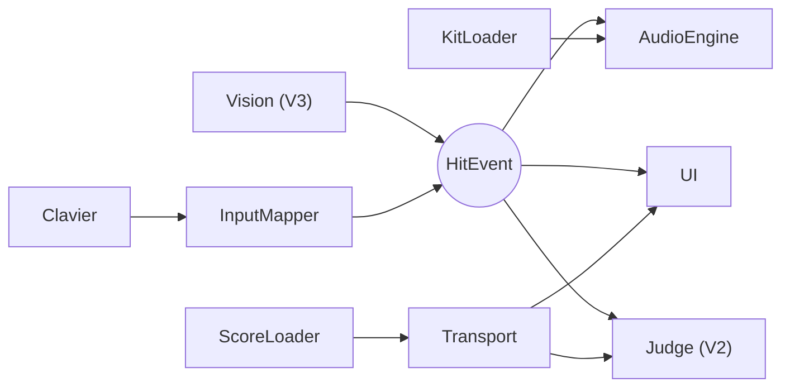

# Architecture technique

> Source de départ : [cadrage, partie B §3 et §4](00-cadrage.md#3-stack-technique). Ce document suit l'architecture réelle du code ; chaque écart notable est justifié par un ADR.

## Stack

Voir le tableau du [cadrage §3](00-cadrage.md#3-stack-technique). Versions effectives : celles de `pyproject.toml` et `uv.lock`.

## Composants

_Schéma détaillé : [cadrage §4.1](00-cadrage.md#41-composants). À mettre à jour à chaque phase._

## Modèle de données

_Voir [cadrage §4.2](00-cadrage.md#42-modèle-de-données) ; remplacer par le modèle réel (dataclasses de `core/`) dès la phase 01._

## Boucle principale et temps

_À documenter en phase 01 : fréquence de lecture des entrées, rendu, horloge unique._

## Décisions

- [ADR 0001 — Choix du moteur audio](adr/0001-choix-du-moteur-audio.md)
